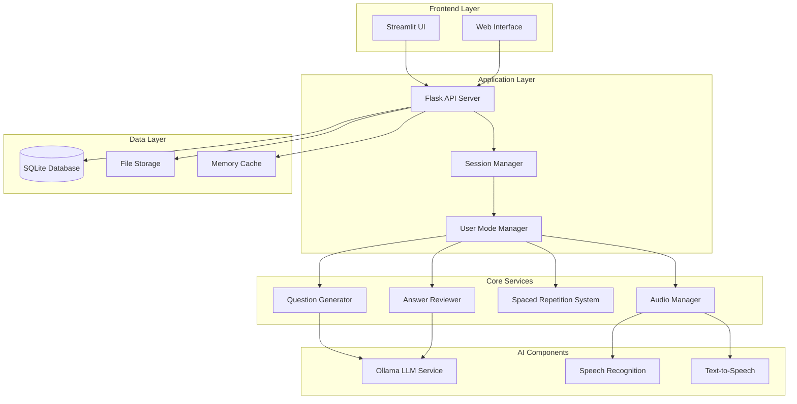
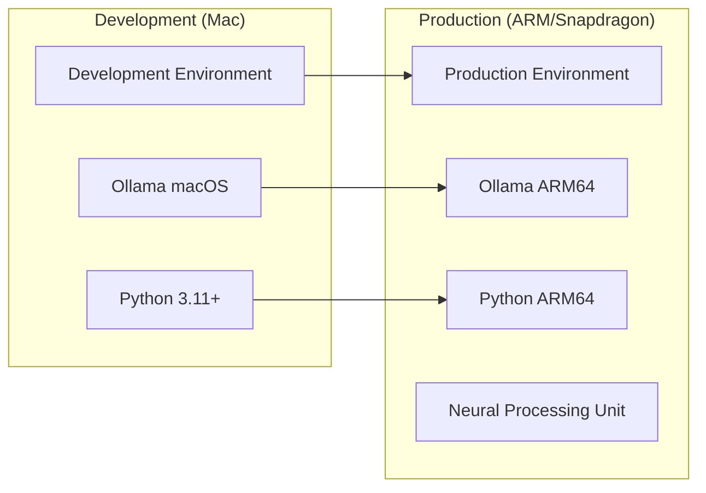

# AnkiVoice Architecture Documentation

## System Overview

AnkiVoice is designed as a modular, edge-AI application with the following key characteristics:
- **Local-first**: All AI processing happens on-device
- **Modular**: Each component can be independently optimized or replaced
- **Cross-platform**: Python-based with Rust migration path
- **Real-time**: Low-latency voice interactions

## High-Level Architecture



## Detailed Component Architecture

### 1. Frontend Layer
- **Streamlit Application**: Main user interface
  - Card management interface
  - Study session controls
  - Progress visualization
  - Mode selection and configuration
  - Real-time audio controls

### 2. Application Layer

**Flask API Server**:
- RESTful endpoints for all operations
- WebSocket support for real-time audio streaming
- Session management and authentication
- Request routing and validation

**Session Manager**:
- Manages study sessions
- Tracks session state and progress
- Handles session persistence and recovery

**User Mode Manager**:
- Implements the 4+ interaction modes from your document
- Mode switching logic
- User preference management

### 3. Core Services

**Question Generator Service**:
- Converts input material into Q&A pairs
- Uses LLM to generate multiple question perspectives
- Validates and refines generated questions
- Supports batch processing

**Answer Reviewer Service**:
- Evaluates user responses against correct answers
- Uses LLM for semantic understanding
- Provides detailed feedback
- Calculates confidence scores

**Spaced Repetition System**:
- Implements SM-2 or Anki's algorithm
- Schedules card reviews based on performance
- Tracks learning progress
- Optimizes review intervals

**Audio Manager**:
- Coordinates ASR and TTS operations
- Handles audio streaming and buffering
- Manages audio device configuration
- Provides audio quality optimization

### 4. AI Components

**Ollama LLM Service**:
- Local language model inference
- Question generation prompts
- Answer evaluation prompts
- Model switching capabilities
- Performance optimization for ARM

**Speech Recognition (ASR)**:
- Real-time speech-to-text conversion
- Multiple engine support (Whisper, SpeechRecognition)
- Noise reduction and audio preprocessing
- Language model integration

**Text-to-Speech (TTS)**:
- Natural voice synthesis
- Multiple voice options
- Speed and pitch control
- Audio quality optimization

### 5. Data Layer

**SQLite Database Schema**:
```sql
-- Core tables
Cards (id, content, created_at, updated_at, tags)
Questions (id, card_id, question_text, answer_text, difficulty)
UserProgress (id, card_id, ease_factor, interval, repetitions, last_review)
StudySessions (id, user_id, start_time, end_time, cards_reviewed, performance)
UserSettings (id, user_id, mode_preferences, audio_settings)
```

## Interaction Modes Implementation

Based on your document, here are the modes with their technical implementation:

1. **Default Mode**: Full automation (TTS → ASR → LLM evaluation)
2. **Controlled Mode**: User reviews transcription before LLM evaluation
3. **No TTS Mode**: Visual questions with ASR + LLM evaluation
4. **Manual Decision Mode**: User makes final scheduling decisions
5. **Study Mode**: Batch question generation from study material
6. **Review Mode**: Traditional flashcard review with voice
7. **Performance Mode**: Optimized for speed and efficiency

## ARM/Edge Optimization Strategy

**Model Selection**:
- Ollama with quantized models (4-bit, 8-bit)
- Recommended models: Gemma 3:4B, Llama 3.2:3B, Phi-3.5:3.8B
- Model switching based on available resources

**Performance Optimizations**:
- Model caching and warm-up
- Batch processing for question generation
- Asynchronous processing pipelines
- Memory-mapped model loading
- NPU utilization where available

**Resource Management**:
- Dynamic model loading/unloading
- Memory pool management
- CPU/NPU workload balancing
- Power consumption optimization

## Technology Stack

**Backend**:
- Python 3.11+ (with Rust migration path)
- Flask with async support
- SQLAlchemy ORM
- Ollama Python client
- WebSocket support

**Frontend**:
- Streamlit for rapid prototyping
- HTML/CSS/JavaScript for custom components
- Audio recording/playback APIs

**AI/ML**:
- Ollama for LLM inference
- Whisper/SpeechRecognition for ASR
- pyttsx3/gTTS for TTS
- NumPy/SciPy for audio processing

**Data & Storage**:
- SQLite with WAL mode
- JSON for configuration
- File system for audio caches

## Deployment Architecture



## Migration Path to Rust

**Phase 1**: Python implementation with clear module boundaries
**Phase 2**: Replace performance-critical components with Rust
- Audio processing pipeline
- Database operations
- Model inference wrapper
**Phase 3**: Full Rust backend with Python bindings for AI components

## Key Features

This architecture provides:
- ✅ Edge AI capabilities with local processing
- ✅ Multiple interaction modes as specified
- ✅ ARM/Snapdragon optimization
- ✅ Scalable and maintainable design
- ✅ Clear migration path to Rust
- ✅ Real-time voice interaction
- ✅ Robust spaced repetition system

## Next Steps

1. Detailed database schema design
2. API endpoint specifications
3. Prototype implementation
4. Performance benchmarking on target hardware